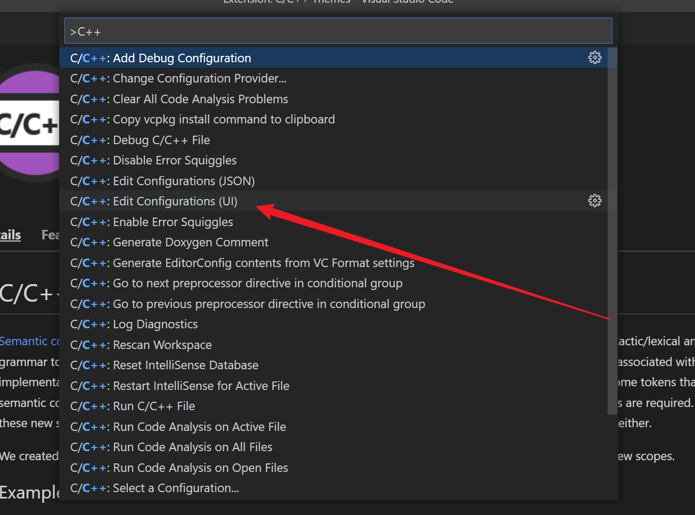

# VSCode C++环境配置

#### 1.基本环境配置

- 选一个C++文本编译程序，这里选用[MinGW-w64](https://www.mingw-w64.org/)

  - 这里通过配置VScode使用，下载对应平台的编译器，这里使用[windows](https://sourceforge.net/projects/mingw-w64/files/)的下载资源，下载压缩包

    

  - 下载压缩包可以提供给vscode使用，只需要解压后，把文件bin目录配置到环境变量path位置
    

  - 通过cmd输入，g++ --version获得以下结果即可
    
  
  - 在VScode中安装C++插件
    
    
  - 在vscode按shift+ctrl+p，进入C++插件配置
    
  
  - 在页面中设置以下配置即可
    
  
  - 写入main.cpp文件，按F5配置Vscode的编译配置
    
  
  - 配置自动设置完成，F5运行得到结果
    