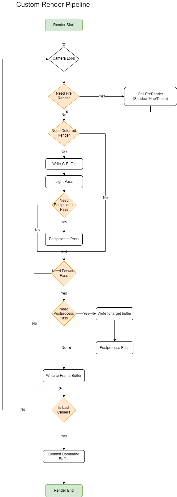

# 渲染管线

#### 1.前言

- 渲染管线是游戏一帧内渲染流程方案
- 其中包含多个渲染流水线流程，渲染流水线流程指当个物体渲染到屏幕的流程，其中包含3个主要阶段
  - Cpu阶段，准备顶点，矩阵，着色器，材质block等数据
  - 几何阶段，顶点变换映射到屏幕，经历固定顶点着色器(指令集)，曲面细分着色器(可配置，自定细分增加顶点用)，几何着色器(可配置，可置换图元生成结果)，最终产出图元数据
  - 光栅化阶段，图片经历三角形配置，三角形设置后获得屏幕覆盖数据，进入片元着色阶段(像素点数据计算指令集)，计算完输出结果后进入片元操作阶段(深度测试->透明测试->模板测试)，经过以上阶段最后依据配置将输出数据与framebuffer的数据进行一个混合输出

#### 2.个人理解

- 渲染管线是一帧内渲染数据映射到二维数据的方案实现，通过Cpu负责预准备，Gpu负责并发运算快速计算获得二维数据结果
- 由于需求 [差异和硬件架构](..\..\..\..\basis\hardware\README.md) 差异，在制定渲染管线时候需要满足能按需切换渲染管线功能，避开硬件架构产生的高消耗
  -  [前向渲染](FORWARDRENDERING.md) 
  -  [延迟渲染](DEFERREDRENDERING.md) 

#### 3.自定义管线结构

