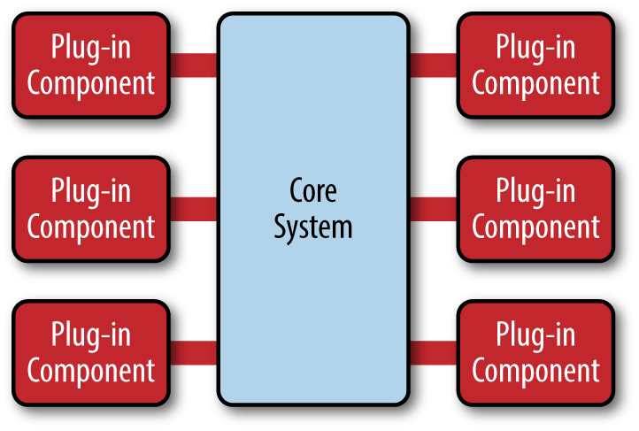

# 架构与框架篇

#### 1.前言

- 首先了解架构和框架是为了在系统研发或者使用过程中有个清晰明确的实践方向

- 目的是为了在最短时间快速完成产品的稳定开发，稳定的版本迭代

#### 2.个人理解

- 架构(Architecture)从字义上来说其实是组织架构，也就是结构描述
- 框架(Framework)从字义上来说是规范约束实现，从程序上保证产品产出稳定，可预期
- 最终目的是为了满足产品产出的稳定，效率，质量，扩展，安全等需求，框架制定的引导，约束，标准，工具等，架构描述了功能

#### 3.个人架构实现

- 首先在扩展上我们需要分离模块，选择[**微核架构**](http://www.ruanyifeng.com/blog/2016/09/software-architecture.html)
  
- 在Unity我们可以使用引擎提供的[PackageManager](https://docs.unity.cn/2020.3/Documentation/Manual/Packages.html)功能添加自定义Package功能，创建package.json文件

